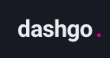
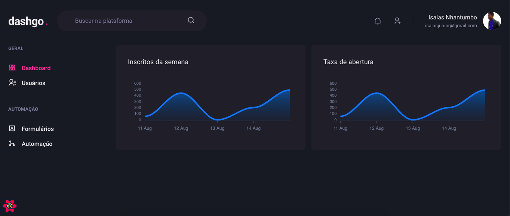
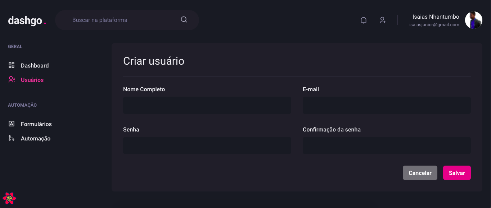

<br/>
<p align="center">
     
</p>

<h2 align="center"> 


<!--  -->

</h2>
<br>

<p align="center">
<a href="#-tecnologias-usadas">Tecnologias usadas</a>&nbsp;&nbsp;&nbsp;|&nbsp;&nbsp;&nbsp;
<a href="#-pré-requisitos">Pré-requisitos</a>&nbsp;&nbsp;&nbsp;|&nbsp;&nbsp;&nbsp;
<a href="#-como-rodar-o-projecto">Como rodar o projecto</a>
</p>
<p align="center">
       
</p>
<p align="center">
O <span>dashgo</span> é dashboard de usuários feito com o chakra ui construindo no Bootcamp Ignite da rockeseat na trilha Reactjs,

<!-- <h1 align="center"><a target="_blank" href="https://letmeask-3fc59.web.app/">Acessar Demonstração</a></h1> -->

## ✅ Features
  - [x] Cadastrar usuarios
  - [x] Listar usuarios
  - [x] Mostrar gráficos
  - [x] Envio de dados para o miragejs com formularios
  - [x] SWR - Stale while reavalidade dos dados 
  - [x] Responsividade


<p align="center">
  
</p>

---
## 🛠 Tecnologias usadas

As seguintes ferramentas foram usadas na construção do projeto:


- ReactJs
- Nextjs
- Typescript
- Chakra UI
- Axios
- Miragejs
- Yup
- React hook form
- React Icons
- React Query
- Apexcharts


---

## ⚠ Pré-requisitos

Antes de começar, você vai precisar ter instalado em sua máquina as seguintes ferramentas:
[Git](https://git-scm.com), [Node.js](https://nodejs.org/en/). 
Além disto é bom ter um editor para trabalhar com o código como [VSCode](https://code.visualstudio.com/)

---
## 🎲 Como rodar o projecto

```bash
# Clone este repositório
$ git clone <https://github.com/isaiasnhantumbo/dashgo.git>

# Acesse a pasta do projeto no terminal/cmd
$ cd dashgo

# Abra a pasta no Visual Studio Code
$ code .

# Instale as dependência
$ yarn

# Configure as variáveis de ambiente do projeto

# Execute a aplicação com o yarn
$ yarn dev

# O servidor iniciara na porta:3000 - acesse <http://localhost:3000>
```

---


## 📘 Licença
Este projecto usa a  [MIT License](LICENSE).
****
<h1 align="center">
👨🏽‍🏫 
<br>
Desenvolvido por
<br>
 Isaias Nhantumbo Junior
</h1>
</p>
<h1 align="center"> 🤝 &nbsp;Vamos nos conectar ?👨 </h1>

<p align="center">
<a href="https://www.youtube.com/channel/UCOyeYkH0MwJ6RrXTcEFFdAQ?view_as=subscriber"></a>
<a href="https://www.linkedin.com/in/isaias-nhantumbo-junior-733bb619b/"></a>
<a href="https://www.instagram.com/isaias_nhantumbo/"></a>
</p>


